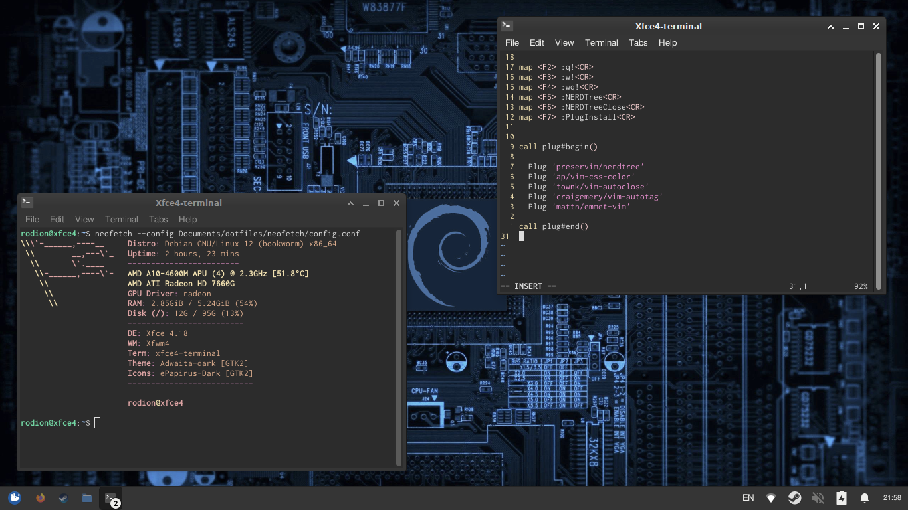

this is my repository, where I'am collect my configs and bash files.

[](https://www.gnu.org/licenses/gpl-3.0)



---

you can clone my repo:

```
git clone https://notabug.org/rodion/dotfiles.git
```

to use bash files you need to grant them access:

```
chmod -x path-to-file
```

all files in this repo, I'm edited or created myself.
some files which I'm created myself (configs don't count), distributed under the GNU GPLv3 license
